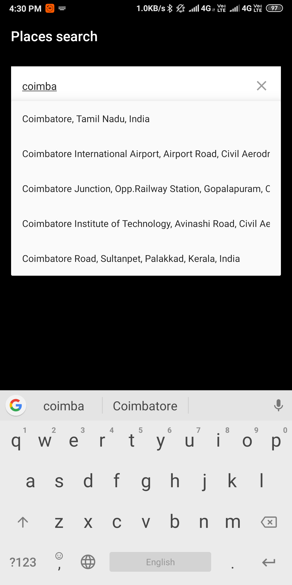

# GooglePlaces

### Screenshot
     

### Installing

Use the following in your `build.gradle`:


```groovy
repositories {
      maven { url 'https://jitpack.io' }
}

dependencies {
      implementation 'com.github.sankarwap:GooglePlaces:1.0'
}
```


1. You'll need a Google Server API key for you application. There are instructions on how to set up your API project and generate a key [here](https://developers.google.com/places/web-service/get-api-key)

2. With your API key, you're ready to add the `GooglePlacesAuto` to your layout xml:

```groovy
    <com.sankarwap.googleplaces.GooglePlacesAuto
            android:id="@+id/autocomplete"
            android:layout_width="match_parent"
            android:layout_height="wrap_content"
            android:layout_gravity="center_horizontal"
            android:padding="16dp"
            android:hint="Address"
            app:pacv_languageCode="en"
            app:pacv_resultType="no_type"
            app:pacv_clearEnabled="true"
            android:background="@color/colorAccent"
            app:pacv_googleMapsApiKey="<"YOUR API KEY">"
            />
```

4. Finally, you'll likely want a listener in your UI to know when the user has selected an places from the dropdown:

        mAutocomplete.setOnPlaceSelectedListener { place ->
            mAutocomplete.getDetailsFor(place, object : DetailsCallback {
                override fun onSuccess(details: PlaceDetails) {
                    hideKeyboard()
                    Log.d("place", "address " + details.formatted_address)
                    Log.d("place", "lat " + details.geometry.location.lat)
                    Log.d("place", "lng " + details.geometry.location.lng)
                    Toast.makeText(this@MainActivity, details.formatted_address, Toast.LENGTH_SHORT)
                        .show()
                }
                override fun onFailure(failure: Throwable) {
                    Log.d("test", "failure $failure")
                }
            })
        }


## License & Copyright
Licensed under the Sankarwap
